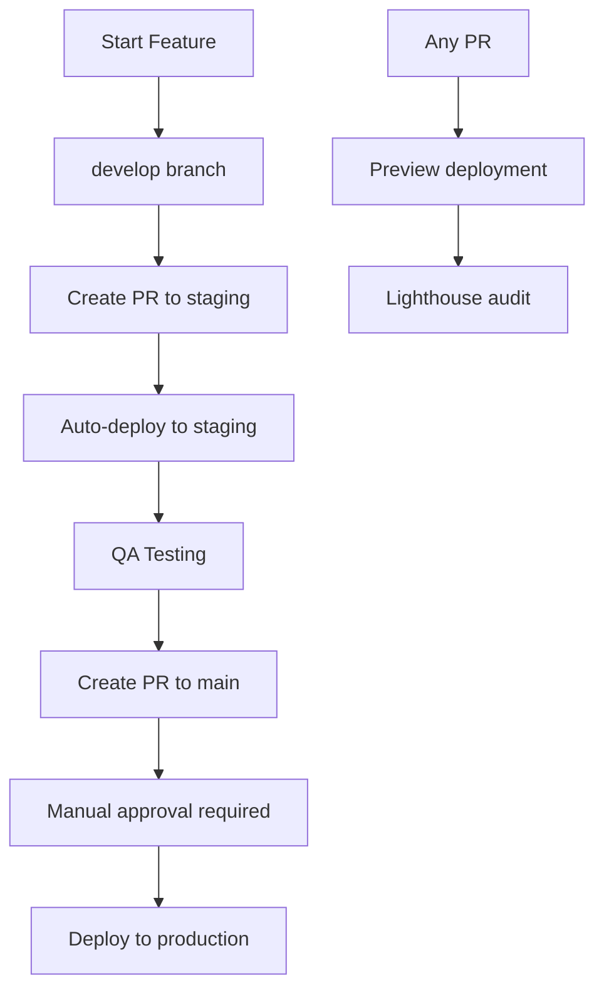

# 🚀 Deployment Setup Guide

This guide will help you set up the advanced CI/CD pipeline with staging and production environments.

## 📋 Prerequisites

- GitHub repository with admin access
- Vercel account connected to GitHub
- The following Vercel credentials (already provided):

## 🔐 Step 1: Add GitHub Secrets

Go to your GitHub repository → Settings → Secrets and variables → Actions → New repository secret

Add these three secrets:

### VERCEL_TOKEN

```
[YOUR_VERCEL_TOKEN_HERE]
```

### VERCEL_ORG_ID

```
[YOUR_VERCEL_ORG_ID_HERE]
```

### VERCEL_PROJECT_ID

```
[YOUR_VERCEL_PROJECT_ID_HERE]
```

> 🔒 **CRITICAL SECURITY NOTE**:
>
> - These values should ONLY be added as GitHub repository secrets
> - NEVER commit actual secrets to your repository code
> - The actual values were provided separately and should be copied directly into GitHub's secret management interface

## 🌿 Step 2: Create Required Branches

Run these commands in your terminal:

```bash
# Create and push staging branch
git checkout -b staging
git push origin staging

# Create and push develop branch
git checkout -b develop
git push origin develop

# Return to main branch
git checkout main
```

## 🛡️ Step 3: Set Up Branch Protection

1. Go to GitHub → Settings → Branches
2. Click "Add rule" for `main` branch
3. Configure these settings:
   - ✅ Require a pull request before merging
   - ✅ Require approvals (1)
   - ✅ Dismiss stale PR approvals when new commits are pushed
   - ✅ Require status checks to pass before merging
   - ✅ Require branches to be up to date before merging
   - Add status checks: `Quality Checks`, `Security Audit`
   - ✅ Require conversation resolution before merging

## 🌍 Step 4: Configure GitHub Environments

The workflow will automatically create environments, but you can also set them up manually:

1. Go to GitHub → Settings → Environments
2. Create `staging` environment:
   - No protection rules (auto-deploy)
3. Create `production` environment:
   - Required reviewers: Add yourself
   - Deployment branches: Only `main`

## 🔄 Step 5: Workflow Overview

### Deployment Strategy

| Environment    | Branch    | URL                         | Auto-Deploy | Approval Required |
| -------------- | --------- | --------------------------- | ----------- | ----------------- |
| **Preview**    | Any PR    | Auto-generated              | ✅          | ❌                |
| **Staging**    | `staging` | template-staging.vercel.app | ✅          | ❌                |
| **Production** | `main`    | template.vercel.app         | ❌          | ✅                |

### Development Flow



## 🧪 Step 6: Testing the Setup

### Test Preview Deployments

```bash
# Create a test branch
git checkout -b test/deployment-setup
echo "Test deployment" >> test-file.txt
git add test-file.txt
git commit -m "Test deployment setup"
git push origin test/deployment-setup

# Create PR to staging
# → Should trigger preview deployment and quality checks
```

### Test Staging Deployment

```bash
# Merge PR to staging
# → Should trigger automatic staging deployment
```

### Test Production Deployment

```bash
# Create PR from staging to main
# → Should require manual approval before deploying
```

## 📊 Step 7: Using Deployment Commands

```bash
# Check current deployment status
npm run deploy:status

# Create preview (runs tests first)
npm run deploy:preview

# Promote staging to production (guided process)
npm run deploy:promote

# View all deployment options
npm run deploy
```

## 🎯 Quality Gates

Every deployment goes through these automated checks:

- **🔨 Type Check**: TypeScript compilation
- **🧹 Linting**: ESLint code quality
- **🎨 Formatting**: Prettier formatting check
- **🧪 Testing**: Full test suite with coverage
- **🔒 Security**: npm audit for vulnerabilities
- **🏗️ Build**: Production build verification
- **🔍 Performance**: Lighthouse audit on previews

## 🚨 Troubleshooting

### If GitHub Actions fail:

1. Check that all secrets are set correctly
2. Ensure Vercel project is connected to GitHub
3. Verify branch names match exactly

### If Vercel deployment fails:

1. Check Vercel dashboard for error logs
2. Ensure project ID and org ID are correct
3. Verify token has necessary permissions

### If branch protection blocks pushes:

1. Create PRs instead of direct pushes to main
2. Ensure all status checks pass
3. Get required approvals

## 🎉 Next Steps

Once setup is complete:

1. **Test the flow**: Create a test feature branch → staging PR → production PR
2. **Train your team**: Share this workflow with collaborators
3. **Monitor**: Watch deployments and adjust as needed
4. **Iterate**: Refine the process based on your team's needs

## 📞 Support

If you need help:

- Check GitHub Actions logs for detailed error messages
- Review Vercel dashboard for deployment status
- Use `npm run deploy` commands for guided assistance
